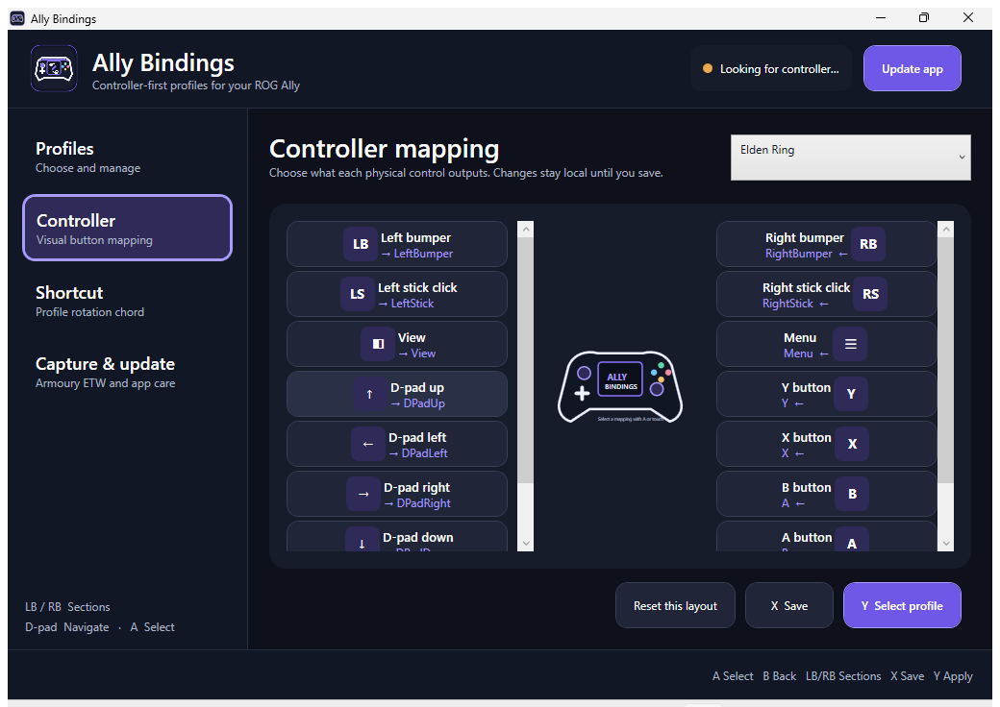
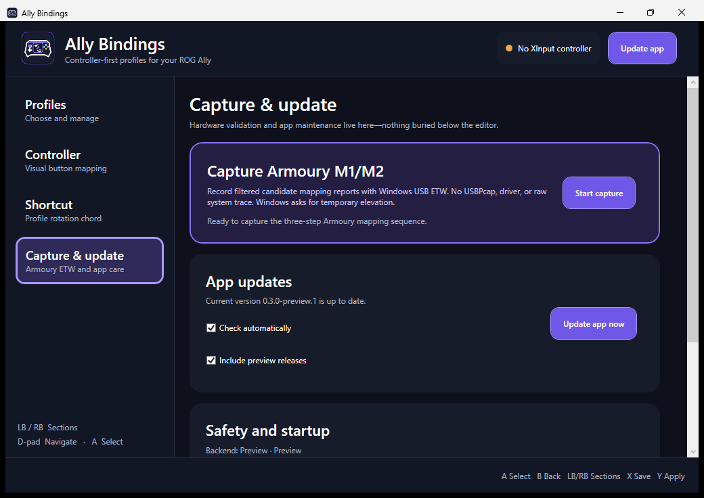
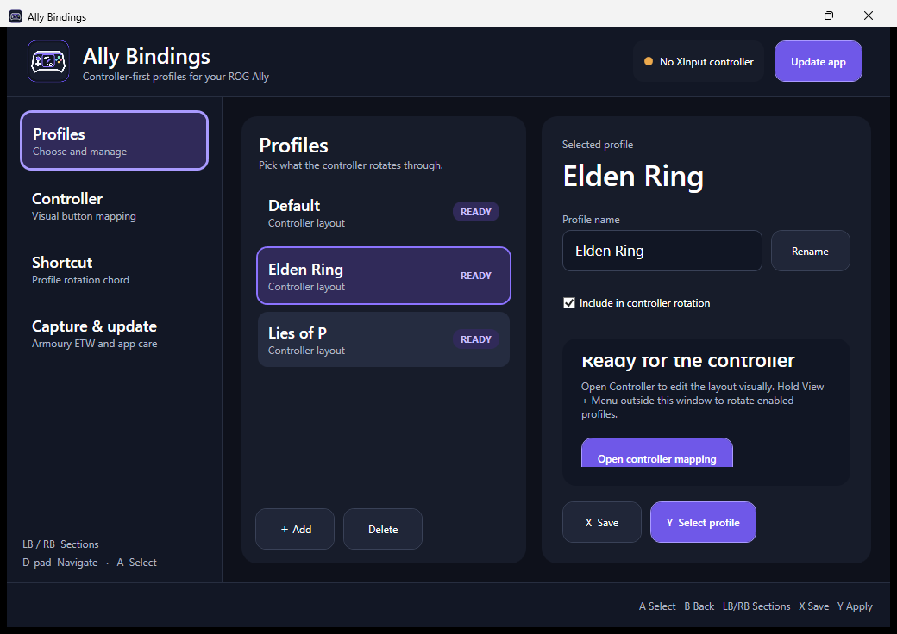
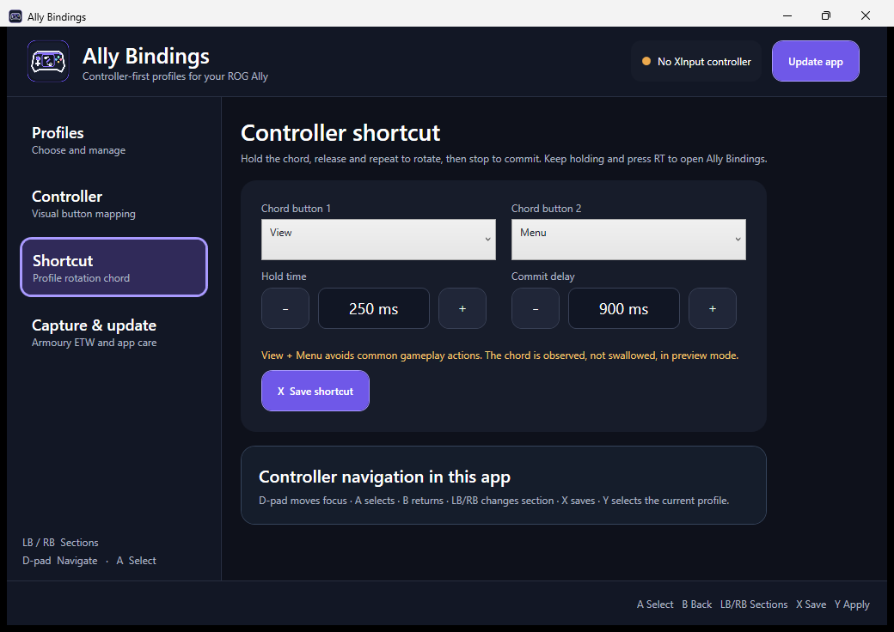

# Ally Bindings

[](https://github.com/dggomes/ally-bindings/actions/workflows/build.yml)
[](https://github.com/dggomes/ally-bindings/releases)
[](LICENSE)
[](#requirements)

A lightweight, local-first Windows controller-profile selector for Xbox Remote Play on the **ROG Xbox Ally X**.

Ally Bindings lets you save named mappings, rotate them from the controller, and see the pending choice in a small overlay. It is intentionally conservative: the current public build exercises the complete profile-selection experience without hiding the physical controller, creating a virtual controller, or writing unvalidated ASUS controller settings.

> **Project status: preview.** This source tree targets `v0.3.0-preview.20`. Standard-button remapping is preview-only. Two preview.19 physical runs proved that the native tap can attach, complete all mapping phases and tear down cleanly while its original `HidD_SetFeature`/`WriteFile` filter retains no packets. Preview.20 expands the target-scoped experiment to `HidD_SetOutputReport` and the two HID SET `DeviceIoControl` codes, with bounded aggregate covered-API, handle-validation and target-filter diagnostics. M1/M2 writes remain locked. The explicit, self-contained Armoury HID write tap temporarily injects an embedded capture-only DLL into exact ASUS-signed Armoury processes after consent and UAC, retains only target `5A D1` writes, and must unload cleanly before success. See [Current capabilities](#current-capabilities) before installing.

Ally Bindings is an independent project and is not affiliated with ASUS, ROG, Microsoft or Xbox.

## Controller-first interface

These are real screenshots captured from the packaged `win-x64` application by the Windows CI workflow.

### Full controller mapping

The mapping workspace follows Armoury Crate's controller-first layout: a large Ally diagram sits between labelled controls for every physical button, trigger and rear paddle. Click or select any of the 18 controls to open its binding window.



### Armoury capture and app updates



<details>
<summary>Profiles and shortcut workspaces</summary>





</details>

## Why this exists

Xbox Remote Play presents multiple streamed games through the same Windows process, so process-based controller profiles cannot reliably tell them apart. Ally Bindings makes the profile choice explicit and controller-driven:

1. Hold **View + Menu**.
2. Release and repeat the chord to rotate through enabled profiles.
3. Pause for 900 ms to commit the displayed profile.
4. Keep the chord held and press **RT** to open the editor.

The chord and timings are configurable. The app can remain in the notification area and start automatically when you sign in.

## Current capabilities

| Capability | Status |
|---|---|
| Named local profiles | **Working** |
| Profile editor and validation | **Working** |
| Controller-first/touch UI with gamepad navigation | **Working** |
| Visual controller binding editor | **Working** |
| Controller chord and overlay | **Working** |
| Tray mode and sign-in startup | **Working** |
| Reopening the running startup/tray instance | **Working** |
| Branded application and notification-area icon | **Working** |
| Panic/default shortcut (`Ctrl+Alt+F12`) | **Working** |
| Automatic and manual update checks | **Working** |
| Verified GitHub Releases updater with rollback | **Working** |
| Read-only ASUS report `0x5A` snapshot | **Working; physical validation required and zero write authority** |
| Self-contained Armoury HID write tap | **Diagnostic preview; explicit UAC/consent, ASUS-process-only, zero write authority** |
| USB ETW Armoury M1/M2 protocol capture | **Working; retained as deeper diagnostic fallback and write-locked** |
| Standard XInput remapping | **Preview only** |
| ASUS M1/M2 controller-setting writes | **Disabled pending physical validation** |
| Physical-device hiding / virtual controller output | **Not enabled** |

Selecting a profile currently updates Ally Bindings' state and UX. It does **not** yet claim that transformed standard-button input reached Remote Play.

## Requirements

- Windows 11 x64. Windows 10 2004+ is the build target, but the physical validation target is Windows 11 on the ROG Xbox Ally X.
- An XInput-compatible controller; the built-in Ally X controller is the intended target.
- No administrator rights for normal launch.
- Optional protocol capture enumerates running processes matching nine exact allowlisted ASUS Armoury executable names. With explicit disclosure and one-time UAC, it may temporarily inject an embedded capture-only DLL into every verified candidate; capture is rejected if more than twelve candidates pass verification. It installs no driver or separate application, unloads/deletes the DLL at teardown, and offers Windows USB ETW only as an explicitly accepted fallback when safe injection is unavailable.

## Install

### Published preview

1. Open [Releases](https://github.com/dggomes/ally-bindings/releases).
2. Download the latest `AllyBindings-<version>-win-x64.zip` asset.
3. Extract it to a normal user-writable folder such as `%LOCALAPPDATA%\Programs\AllyBindings`.
4. Run `AllyBindings.exe`.

Releases are currently **not Authenticode-signed**, so Windows SmartScreen may show an unknown-publisher warning. GitHub publishes a SHA-256 digest for each release asset, and Ally Bindings verifies that digest before installing an update.

### Pull-request build

For unreleased testing, open the latest successful [Build workflow](https://github.com/dggomes/ally-bindings/actions/workflows/build.yml), select the run and download the `AllyBindings-win-x64` artifact. Pull-request artifacts are development builds, not releases.

## First run

1. Open Ally Bindings. A normal launch shows the main window; sign-in startup alone stays quietly in the tray. Launching the EXE again reveals that existing tray instance.
2. Use the large **Profiles**, **Controller**, **Shortcut**, and **Capture & update** sections by touch or controller.
   Profile rename, timing changes, binding selection, save/apply, capture prompts and update confirmations are controller-operable. Windows UAC remains a system-controlled touch/keyboard prompt.
3. Keep the permanent **Default** profile enabled and create or edit named profiles.
4. Leave **Enable experimental ASUS M1/M2 hardware mappings** off; it is locked in the current build anyway.
5. Test profile rotation with the default **View + Menu** chord.
6. Optionally enable **Run in the tray when I sign in**.

Configuration is stored at:

```text
%LOCALAPPDATA%\AllyBindings\config.json
```

Writes are atomic, the previous valid configuration is backed up, and malformed configuration is preserved as a timestamped `.corrupt-*` file before the app returns to a safe Default profile.

## Controller shortcut

- Hold **View + Menu** for 250 ms to select the next enabled profile.
- Release and repeat to continue rotating.
- Stop for 900 ms to commit the displayed item.
- To open the editor, keep **View + Menu held** after the hold threshold and press **RT**. RT must rise after the chord is armed; an already-held trigger does nothing.
- If the controller disconnects before commit, the pending selection is cancelled.

Face-button-only chords such as `A + B` are supported but discouraged while the app is in preview mode because observed inputs are not swallowed and may reach the streamed game.

When the main window is active, use **D-pad** to move focus, **A** to select, **B** to go back, **LB/RB** to change section, **X** to save, and **Y** to select the current profile. Every primary action is at least 48 device-independent pixels high for touch use.

## Read-only Armoury state snapshot

The preferred protocol-discovery path is now a separate, unelevated feature-report snapshot. It issues one bounded HID `GET_FEATURE` request for ASUS report `0x5A` at baseline and after each of three deliberate Armoury changes. `GET_FEATURE` is an active USB request, but it is read-only: this workflow has no call path to `SET_FEATURE`, the controller backend or either hardware write gate.

The snapshot workflow:

- confirms the supported ROG Ally model and compatible ASUS report-`0x5A` interfaces before reading, then revalidates the exact identity at every stage;
- reads every compatible interface exactly once per stage with the descriptor's report length, bounded to 50–64 bytes, a three-second timeout and no retry;
- uses no administrator elevation, ETW session, system-wide trace, named pipe, helper process, driver or Armoury database access;
- records baseline, `M1=A / M2=B`, `M1=X / M2=Y`, and Armoury's Reset to Default;
- stores exact bounded report bytes as hex plus per-report SHA-256, expected-vector comparisons, changed offsets and reset-to-baseline analysis;
- labels every result **REVIEW REQUIRED**, sets `hardwareUnlockEvidence=false`, and cannot alter source-locked custom or recovery writes;
- creates one ZIP containing `snapshot.json`, `manifest.json` and `README.txt`, then displays the ZIP's SHA-256.

### One-time snapshot procedure

1. Photograph or export any custom Armoury M1/M2 assignments.
2. Open **Capture & update** and choose **Start snapshot** in **Snapshot M1/M2 state · read-only**.
3. Read the consent disclosure and confirm the displayed ROG Ally model and compatible ASUS HID interfaces.
4. Follow the prompts for `M1=A / M2=B`, `M1=X / M2=Y`, and Armoury's **Reset to Default**. Ally Bindings reads report `0x5A` once at each stage.
5. Keep the generated ZIP under `%LOCALAPPDATA%\AllyBindings\captures\`, record its displayed SHA-256 separately if it will be reviewed, and share it only deliberately.

Successful reports contain private controller-configuration bytes. The ZIP lives in a user-writable directory, so its hashes detect accidental or unsophisticated modification but do not create immutable provenance. Require at least two independent matching physical runs and human review before making any protocol claim. No snapshot verdict automatically unlocks writes.

The existing Windows USB ETW capture remains available as a deeper diagnostic fallback. It still requires UAC because its helper consumes system-wide providers, writes no raw ETL/PCAP, retains only bounded exact candidates plus metadata-only UCX shapes, and has zero write authority. V14 showed that Windows did not emit UCX data-bearing completion events 22/25 for these actions, so ETW is no longer the preferred next experiment.

More detail: [hardware validation runbook](docs/HARDWARE-SPIKE.md).

## Updates

- Automatic update checks run at most once every 24 hours by default and can be disabled.
- The always-visible **Update app** button, and **Update app now** under **Capture & update**, run the same public GitHub Releases check immediately.
- Installation is never silent: the release is shown and confirmation is required.
- The updater requires GitHub's SHA-256 asset digest, rejects unsafe ZIP paths, symlinks and duplicate entries, stages files before exit, replaces the executable last, and retains application/configuration backups until the new app confirms successful initialization.
- Failure or timeout attempts every rollback step and relaunches the previous app. Incomplete rollback is reported explicitly.
- Profiles live outside the application folder and are not replaced.

The updater protects against corruption and mismatched downloads. Until releases are Authenticode-signed, it does not protect against compromise of the repository or its release credentials.

## Safety and privacy

- No account, telemetry, cloud sync or network listener.
- Update checks contact only GitHub's HTTPS API and release-download hosts.
- No injection into games, Xbox, anti-cheat or arbitrary processes. The explicit Armoury diagnostic may temporarily inject only an embedded, hash-verified capture DLL into exact allowlisted x64 ASUS-signed Armoury processes under trusted Windows/Program Files roots; it is unloaded and deleted at teardown.
- No Armoury database mutation, macros, turbo or anti-cheat bypasses.
- No driver is installed or updated by Ally Bindings.
- The permanent Default profile cannot be edited or deleted.
- `Ctrl+Alt+F12` provides a keyboard recovery/default path.
- The current build sends no custom or recovery ASUS M1/M2 report.
- Read-only snapshots fail closed on unsupported model, interface ambiguity, target-identity changes or out-of-bounds report lengths; they use no elevation or system-wide trace and have zero write authority.
- USB ETW capture fails closed on device ambiguity, unavailable providers, dropped events or target-identity changes; no raw system-wide trace is written.
- Normal diagnostics contain configuration/status metadata, not input history. Capture bundles are separate, explicit private artifacts.

Please report security concerns privately using the process in [SECURITY.md](SECURITY.md), not a public issue.

## Build and test

Requires the .NET 8 SDK.

```powershell
git clone https://github.com/dggomes/ally-bindings.git
cd ally-bindings
dotnet test AllyBindings.sln --configuration Release
./scripts/package.ps1
```

Core tests also run on macOS and Linux:

```bash
dotnet test tests/AllyBindings.Core.Tests/AllyBindings.Core.Tests.csproj -c Release
```

The WPF app can be cross-compiled with Windows targeting enabled, but Windows packaging, updater rollback and integrated ETW lifecycle checks must pass on a Windows runner.

## Repository map

- `src/AllyBindings.Core` — profile/configuration model, persistence, mapping engine, backend contracts, carousel state machine and privacy-filtered ETW payload extractor.
- `src/AllyBindings.Windows` — WPF UI, tray, overlay, XInput polling, startup registration, updater, the explicit Armoury tap helper and ETW fallback orchestration.
- `native/ArmouryTap` — capture-only x64 hook DLL built into the managed executable; not shipped as a loose binary.
- `tests/AllyBindings.Core.Tests` — deterministic core and protocol-parser tests.
- `docs/ARCHITECTURE.md` — boundaries, data flow and safety invariants.
- `docs/HARDWARE-SPIKE.md` — physical Ally validation and rollback matrix.
- `docs/PLAN.md` — delivery state and release gates.
- `examples/config.sample.json` — readable sample configuration.

## Project documents

- [Changelog](CHANGELOG.md)
- [Contributing](CONTRIBUTING.md)
- [Security policy](SECURITY.md)
- [Architecture](docs/ARCHITECTURE.md)
- [Hardware validation](docs/HARDWARE-SPIKE.md)
- [MIT licence](LICENSE)

## Scope

Ally Bindings is a profile selector—not an Armoury Crate replacement. It does not change TDP, fan, RGB, display or Armoury game-profile settings, and it does not infer the streamed Xbox title from video or OCR.
